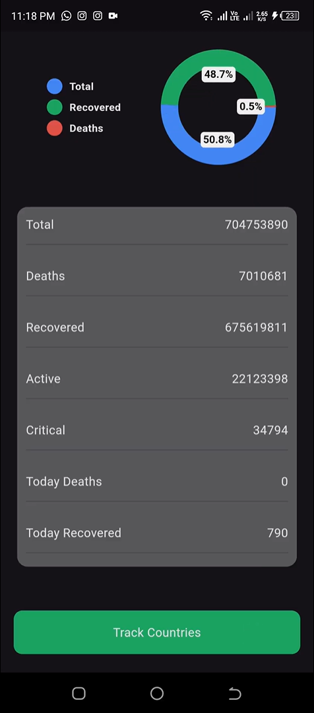
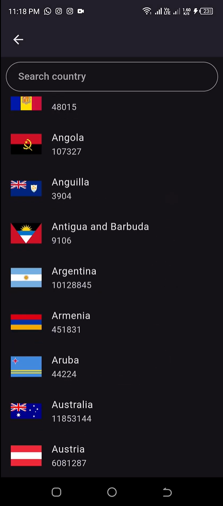
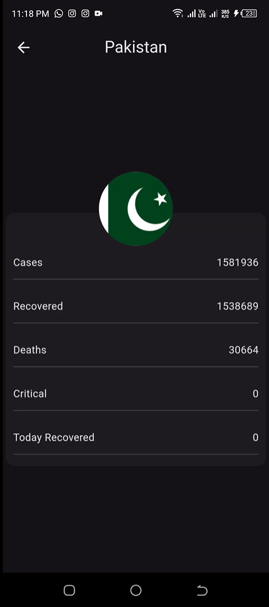

# 🌍 Covid Tracker - Flutter App  
**Real-time global & country-specific COVID-19 statistics**  

[](https://flutter.dev)
[](https://disease.sh/v3/covid-19/)

## 📌 Overview  
A Flutter app that fetches **real-time COVID-19 data** from a public REST API. Features:

- 🌐 Global stats dashboard (cases, deaths, recoveries)
- 🗺️ Country-wise data with interactive list
- 📊 Visual charts for trend analysis
- ⚡ Real-time updates

## 🛠️ Tech Stack  
- **Framework**: Flutter
- **API**: [disease.sh/v3/covid-19](https://disease.sh/v3/covid-19)
- **HTTP Client**: `http` package
- **Charts**: `pie_chart`

## ✨ Features  
✅ Real-time global COVID-19 statistics  
✅ Country-specific data breakdown  
✅ Pie Charts
✅ Searchable country list  
✅ Pull-to-refresh functionality  

## 📸 Screenshots  
| Global Stats | Country List | Country Details |
|-------------|-------------|----------------|
|  |  |  |

## 🚀 Installation  
1. Clone the repository:
    ```bash
    git clone https://github.com/yourusername/covid-tracker.git
    cd covid-tracker
2. Install Dependencies:
   ```bash
    flutter pub get
4. Run the app:
   ```bash
    flutter run

## 🧩 API Endpoints Used
    ```md
      ```dart
        // Global data
        final globalData = await http.get(Uri.parse('https://disease.sh/v3/covid-19/all'));
        
        // Country list
        final countries = await http.get(Uri.parse('https://disease.sh/v3/covid-19/countries'));
        
        // Country-specific data
        final countryData = await http.get(Uri.parse('https://disease.sh/v3/covid-19/countries/$countryCode'));

  

